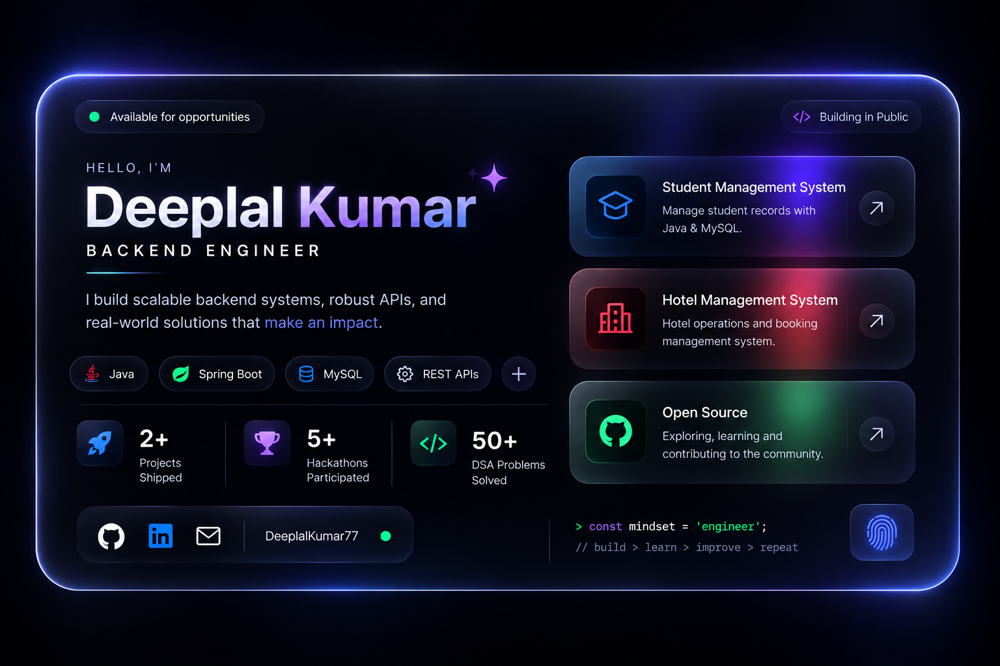

👋 Hi, I'm Deeplal Kumar

☕ Backend Engineer | Java | Spring Boot | REST APIs

I build backend applications using Java and Spring Boot, with a focus on clean code, REST APIs, databases, and real-world software projects.

🧠 whoami

public class DeeplalKumar {

    String name = "Deeplal Kumar";
    String role = "Backend Engineer";
    String education = "B.Tech - Computer Science & Engineering";

    String[] skills = {
        "Java",
        "Spring Boot",
        "REST APIs",
        "MySQL",
        "Git & GitHub"
    };

    String[] interests = {
        "Backend Engineering",
        "Software Development",
        "Problem Solving"
    };
}

🛠️ Tech Stack

Category

Technologies

Language

☕ Java, Python, JavaScript

Backend

🌱 Spring Boot, Spring MVC, REST APIs

Database

🗄️ MySQL, MongoDB, PostgreSQL

Tools

🔧 Git, GitHub, Postman, IntelliJ IDEA, VS Code

Other

🐳 Docker, AWS

🚀 Projects

Project

Description

Technologies

🎓 Student Management System

Application to manage student records, including adding, updating, deleting, and viewing student information.

Java OOP MySQL

🏨 Hotel Management System

System for managing hotel operations, room booking, customer details, and billing-related records.

Java MySQL OOP

📚 Currently Learning

☕ Advanced Java

🌱 Spring Boot

🔗 REST API Development

🗄️ Spring Data JPA & Hibernate

🐳 Docker

☁️ AWS

🧩 Data Structures & Algorithms

🎯 Goals

Build production-ready backend applications

Strengthen Java & Spring Boot skills

Improve DSA and problem-solving

Learn cloud and deployment technologies

Contribute to open-source projects

📊 GitHub Analytics

🔥 Contribution Streak

🌐 Connect With Me

> const mindset = "engineer";
> build > learn > improve > repeat

⭐ Thanks for visiting my profile!

